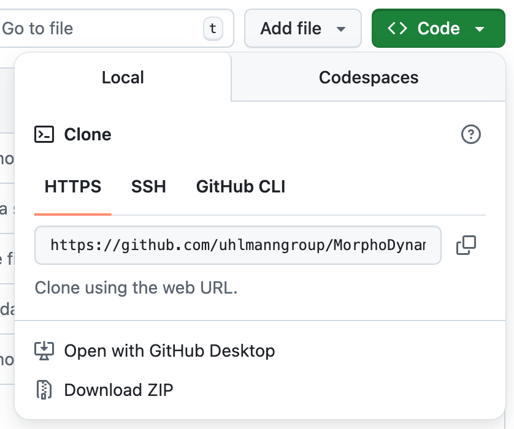

# MorphoDynamicsPipe
A library that uses snakemake to run a morphodynamics analysis on images of cells or nuclei. 
It includes segmentation via cellpose and tracking via btrack. 
MorphoDynamics features are calculated with scikit-image, CPDA chord measurement and other custom functions.
MorphoDynamics can be run with Docker, mamba, conda or pip. MorphoDynamics requires an NVIDIA GPU or Apple Silicon to run the segmentation. If you have another segmention method you can provide the segmentations in the format shown in the example to skip this step. 

## Download the repository 
Clone this github repository using
`git clone https://github.com/uhlmanngroup/MorphoDynamicsPipe`

or alternatively click the 'Download Zip' button on this github page:



and then unzip the folder.

Either method will create a folder called MorphoDynamicsPipe. This is where you will perform your analysis. 


## Data setup
To run this for the first time, it is recommended to start with the exmaple data. An example dataset can be found in `MorphoDynamicsPipe/example/`.
To run the example data, copy the folder `MorphoDynamicsPipe/example/1_data` to `MorphoDynamicsPipe/1_data`, including the the subfolders and files. 

To run on your own data, create a folder called `1_data` inside the main MorphoDynamicsPipe folder. 
Put data in the in the format 
`1_data/folder1/filename1_T=000.tif`, `1_data/folder1/filename1_T=001.tif`, `1_data/folder1/filename1_T=002.tif`, 
`1_data/folder2/filename2_T=000.tif`, `1_data/folder2/filename2_T=001.tif`, `1_data/folder2/filename2_T=002.tif`, 
etc...

where the folder1, folder2, filename1 and filename2 (etc...) can be anything, and filename1 and filename2 (etc...) do not have to be consistent within each subfolder. 
The files must be tiffs with T=[NUMBER].tiff or T=[NUMBER].tif at the end. 
The T= number must run from 0 and increment by one across all the files in each folder. There is no limit on the number of folders or files. 

## Set up your snakemake file
For the example data, no changes need to be made in the snakemake file `run_example.smk`. For your own data you may wish to make changes:

To use nuclei for tracking whole cells, first segment and track nuclei in a separate folder. Then put whole cells in a new MorphoDynamicsPipe folder. 
Comment out `rule segment_with_cellpose_nucs` and comment in `rule segment_with_cellpose_celltracker_with_nucs`. 
Comment out `rule track_with_btrack` and comment in `rule symlink_to_btrack_info` and comment in either the `ln -s` line or the `cp` line (but not both).
Then run as normal. 

## Option 1: Execution using conda (or mamba) on Linux / macOS Apple Silicon
1) Install conda (or mamba) using the instructions here:
https://github.com/conda-forge/miniforge
2) Then open a terminal and navigate to the MorphoDynamicsPipe folder that you have downloaded. After opening this folder, run `chmod +x run_conda.sh` (or `chmod +x run_mamba.sh`) to make the shell script executable. Then run `source run_conda.sh` (or `source run_mamba.sh`) to run the pipeline on the data. 

## Option 2: Execution using docker on Linux with NVIDIA GPU (NVIDIA drivers already installed)
1) Install docker using the instructions here:
https://docs.docker.com/engine/install/
or
https://docs.docker.com/desktop/
2) Then open a terminal and navigate to the MorphoDynamicsPipe folder that you have downloaded. After opening this folder, run `chmod +x run_docker.sh` to make the shell script executable. Then run `source run_docker.sh` to run the pipeline on the data. 
3) It is not recommended to run docker on Apple Silicon as it cannot access the Metal Performance Shader capabilities, meaning that cellpose 4 runs too slowly. This is also true on machines without a GPU. 

## Option 3: NVIDIA drivers not already installed on Linux (but NVIDIA GPU exists)
See 'Docker installation' at the end of this page. 

## Option 4: Execution using pip on any OS
1) Create a virtual environment with python=3.11.11 and pip=25.3
2) Activate the environment
3) pip install -r requirements-base.txt
4) snakemake -s run_example.smk --cores 4 --keep-going

## Option 5: Execution using conda (or mamba) on Windows
1) Install conda (or mamba) using the instructions here:
https://github.com/conda-forge/miniforge
2) Then navigate in to the MorphoDynamicsPipe folder in a commmand prompt that has conda activated (such as miniforge prompt, which can be normally found on the start menu). 
3) Then run `conda create -c conda-forge -c nodefaults -n morphody50 python==3.11.11 pip==25.3 -y` (or `mamba create -c conda-forge -c nodefaults -n morphody50 python==3.11.11 pip==25.3 -y`). This only needs to be run for the first time using the pipeline. 
4) Run `conda activate morphody50` (or `conda activate morphody50`)
5) Run `pip install -r requirements-base.txt`
6) Run `snakemake -s run_example.smk --cores 4 --keep-going`


## Other notes
If you would like to run the pipeline on another project, simply copy the `.smk` file 
and the `scripts/` folder (including its files) next to another `1_data` 
e.g. `project2/1_data/` , `project2/run_exmaple.smk` and `project2/scripts`. 
Then at the command line, navigate to the project2 folder and run the snakemake command as above.

Parameters can be changed in the python files themselves. 


## Results

Segmentation and tracking results can be viewed in napari (installed with the conda environment) from folder `5_tracking_images_outlines/`.

Morphodynamics results can be found in the folders `4a_instantaneous_cell_morphodynamics/` and `4b_time_averaged_cell_morphodynamics/`.

Example results can be found in the folder `MorphoDynamicsPipe/example/`

macOS seems to produce slightly different segmentation results. 

## Other notes


## Citations
This library relies on: \
Cellpose https://github.com/MouseLand/cellpose \
btrack https://github.com/quantumjot/btrack \
Scikit-image https://github.com/scikit-image/scikit-image \
CPDA curvature measurement https://ieeexplore.ieee.org/document/4657455 \
among other commonly used packages. 

Example data is taken from Broad Bioimage Benchmark Collection (Broad Institute), 
simulated HL60 cells (from the Cell Tracking Challenge), Accession number BBBC035, Version 1. https://bbbc.broadinstitute.org/BBBC035

This package is part of the PLAST_CELL project. \
More details on this are here: https://plastcell.eu/


## Docker installation (FOR DEBIAN)

To run this part you will need docker and the nvidia-docker toolkit

### Docker

```bash
curl -fsSL https://get.docker.com -o install-docker.sh
./install-docker.sh
```


Visit [text](https://docs.nvidia.com/datacenter/cloud-native/container-toolkit/latest/install-guide.html#with-apt-ubuntu-debian) for information on nvidia docker wrapper.

### Configure the wrapper

Update apt cache from sources
```bash
curl -fsSL https://nvidia.github.io/libnvidia-container/gpgkey | sudo gpg --dearmor -o /usr/share/keyrings/nvidia-container-toolkit-keyring.gpg \
  && curl -s -L https://nvidia.github.io/libnvidia-container/stable/deb/nvidia-container-toolkit.list | \
    sed 's#deb https://#deb [signed-by=/usr/share/keyrings/nvidia-container-toolkit-keyring.gpg] https://#g' | \
    sudo tee /etc/apt/sources.list.d/nvidia-container-toolkit.list

sed -i -e '/experimental/ s/^#//g' /etc/apt/sources.list.d/nvidia-container-toolkit.list

sudo apt-get update
```

Install the packages fetched

```bash
export NVIDIA_CONTAINER_TOOLKIT_VERSION=1.17.8-1
  sudo apt-get install -y \
      nvidia-container-toolkit=${NVIDIA_CONTAINER_TOOLKIT_VERSION} \
      nvidia-container-toolkit-base=${NVIDIA_CONTAINER_TOOLKIT_VERSION} \
      libnvidia-container-tools=${NVIDIA_CONTAINER_TOOLKIT_VERSION} \
      libnvidia-container1=${NVIDIA_CONTAINER_TOOLKIT_VERSION}

```

Update docker configuration

```bash
sudo nvidia-ctk runtime configure --runtime=docker
sudo systemctl restart docker
```

### Run/Build the image

```bash
docker compose up
```

to force build add ``--build`` to the command. It will pick up jobs left in the 1_data/ folder and post in the other number_folders/
